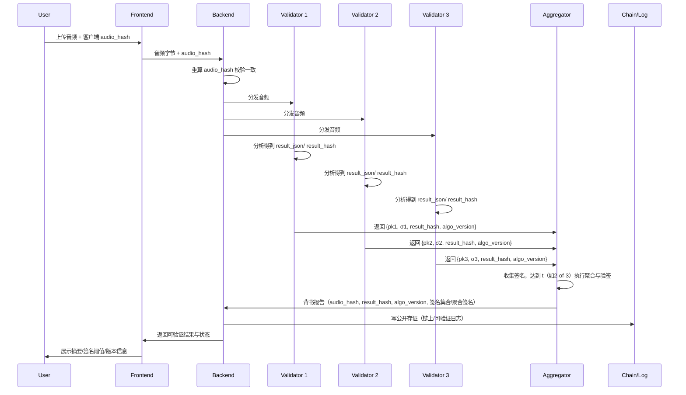

# EchoRank DVT 不可篡改与一致性设计

## 目标
- 用多方阈值签名（DVT, Threshold Signatures）为“语音分析结果”提供去中心化背书，保证全程不可篡改与结果一致性
- 面向评委/开发者提供可验证的数学与工程解释

## 术语与数据
- audio_hash：上传音频字节的 SHA256 摘要（客户端与服务端各自计算并校验）
- result_json：AI 分析的结构化结果（情感、关键词、评分输入等）
- result_hash：对 result_json 的 SHA256 摘要
- algo_version：分析代码/模型镜像的不可变版本标识（容器镜像 Digest/代码哈希）
- m（消息）：domain_sep || audio_hash || result_hash || algo_version || timestamp || nonce
- sk_i/pk_i：第 i 个验证节点的私钥/公钥
- σ_i：第 i 个节点对消息 m 的签名 g t
- t-of-n：n 个验证节点中至少 t 个签名聚合后才有效
speck256 k1 r1
## 技术实现（流程）
1) 客户端上传
   - 本地计算 audio_hash，连同音频一并上传
   - 服务端重算并校验一致性（防中途篡改）
2) 分发与分析
   - 后端将 audio_hash 与原始音频分发给 n 个独立验证节点
   - 每个节点在固定版本的镜像与模型上对音频进行分析，生成 result_json，并计算 result_hash
3) 节点签名
   - 每节点构造消息 m，并用 sk_i 生成签名 σ_i，返回 {pk_i, σ_i, result_hash, algo_version}
4) 聚合与验签
   - 聚合器收集签名，达到 t 个后进行 BLS 聚合，得到 σ_agg 与 pk_agg（或保留签名集合）
   - 验证等式成立后输出“背书报告”：audio_hash、result_hash、algo_version、t-of-n 证明、时间戳
5) 存证与展示
   - 把“摘要+聚合签名/多签列表+版本号”写公开存证（链上或可验证日志）
   - 前端展示“不可篡改状态”：音频摘要、结果摘要、签名阈值状态

## 数学原理（简述）
- 摘要抗碰撞：SHA256(audio) 与 SHA256(result_json)
  - 若中途改动任何字节，摘要将变；通过“客户端提供 + 服务端重算”二次校验防传输路径篡改
- BLS 签名（单签）
  - 给定消息 m，签名 σ_i = sk_i · H(m)，公钥 pk_i = sk_i · G
  - 验签：e(G, σ_i) == e(pk_i, H(m))（e 为双线性配对）
- BLS 聚合（多签）
  - 多个签名对同一消息 m 可加和：σ_agg = Σ σ_i
  - 若使用聚合公钥 pk_agg = Σ pk_i，则验签：e(G, σ_agg) == e(pk_agg, H(m))
  - 阈值：达到 t 个独立签名即可通过；少于 t 则无法通过验证
- 去中心化信任
  - 单个节点无法单独改变 result_hash，因为需要其他独立节点对同一消息 m 背书
  - 若聚合报告使用签名集合（而非聚合公钥），任何人可逐一验证每个 σ_i 与对应 pk_i

## 为什么不可篡改与一致
- 音频不可篡改：客户端与服务端对同一原始字节计算的 audio_hash 必须一致；不同则拒绝
- 结果不可篡改：节点签名绑定 result_hash 与 algo_version；任何改动会导致验签不通过
- 多方背书：至少 t 个独立节点签名才有效；聚合器无法凭空制造有效聚合签名
- 版本一致性：algo_version 固定，节点在相同镜像与模型上执行，输出可复现结果；版本不一致会被签名绑定暴露
- 公开可验证：任何人可使用 audio_hash 与 result_hash，以及签名集合，独立验算与核验

## 风险与前提
- 节点独立性：节点由不同实体运营，避免串谋攻击；可通过运营方白名单与审计增强独立性
- 摘要与签名的安全性：依赖标准哈希与签名的抗碰撞与不可伪造性
- 聚合器可信最小化：聚合器仅收集与验签；最终公开签名集合供第三方独立验证

## 对照表（步骤—机制—数学保证—不可篡改性）

| 步骤 | 动作 | 机制 | 数学/加密保证 | 带来的不可篡改性 |
|---|---|---|---|---|
| 上传 | 客户端/服务端双算 audio_hash | SHA256 | 抗碰撞 | 中途改动音频立刻被检测 |
| 分析 | 节点执行固定版本算法 | algo_version（镜像/代码哈希） | 可复现/版本锁定 | 算法不可随意变更 |
| 结果摘要 | 计算 result_hash | SHA256 | 抗碰撞 | 改动分析结果将被暴露 |
| 节点签名 | σ_i = sk_i · H(m) | BLS 单签 | 不可伪造 | 节点对消息 m 不可否认 |
| 聚合验签 | e(G, σ_agg) == e(pk_agg, H(m)) | BLS 聚合 | 阈值有效性 | 少于 t 无法伪造结果 |
| 存证 | 摘要+签名公开 | 公开验证 | 第三方可验 | 聚合器无法暗改 |

## 流程图（Mermaid）

## 验证指引
- 校验 audio_hash：客户端与服务端摘要一致
- 校验 result_hash：对后端返回的 result_json 重新摘要
- 校验签名（逐一或聚合）：
  - 单签：检查 e(G, σ_i) == e(pk_i, H(m))
  - 聚合：计算 pk_agg 与 σ_agg，检查 e(G, σ_agg) == e(pk_agg, H(m))
- 校验版本：比对 algo_version 与公开镜像/代码哈希
- 查存证：对照链上/日志条目，确认时间戳与摘要一致

