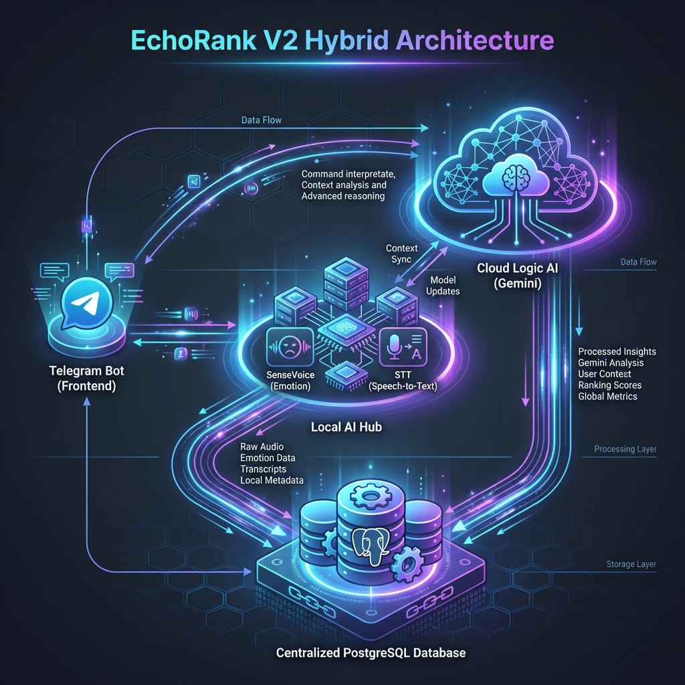
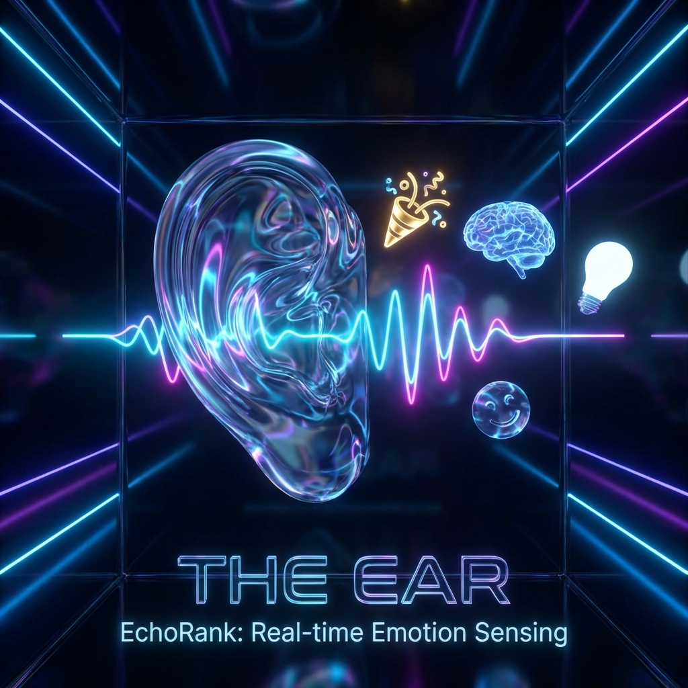
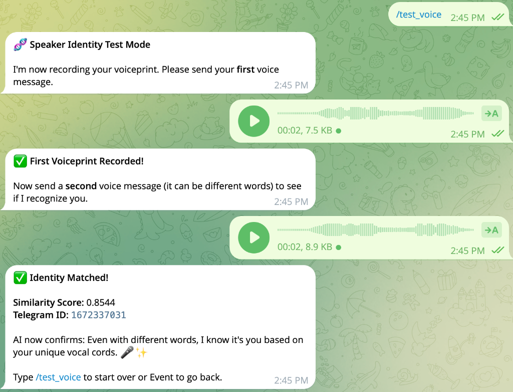
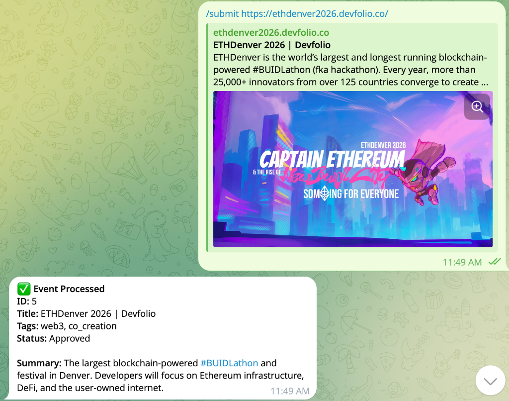
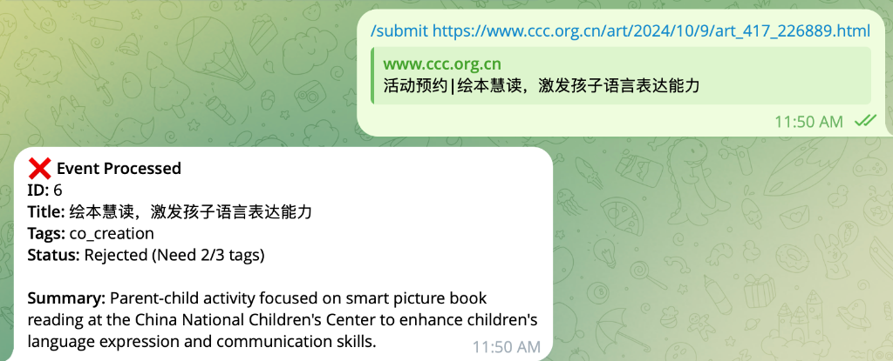
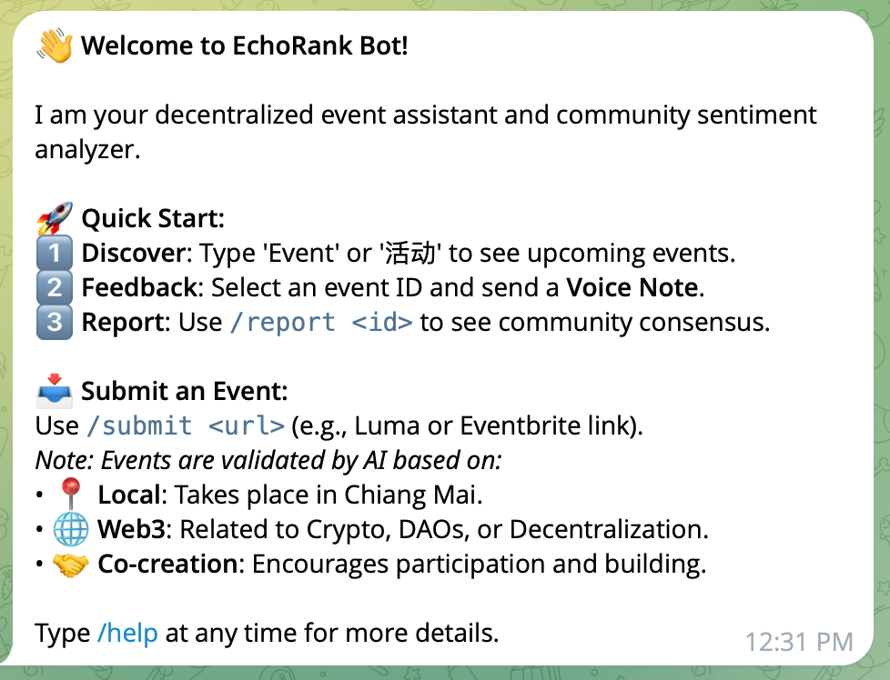
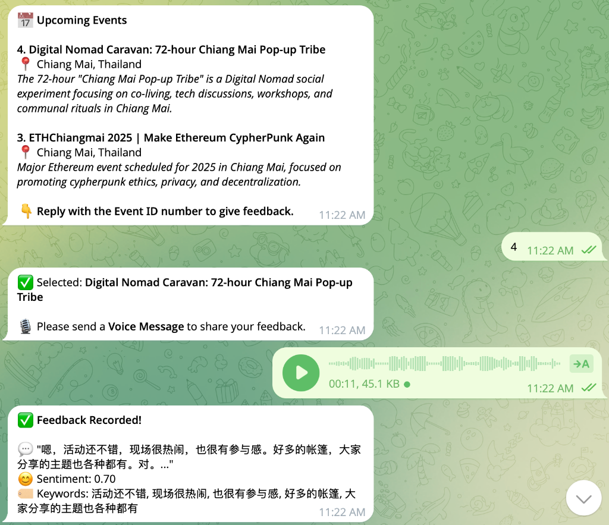
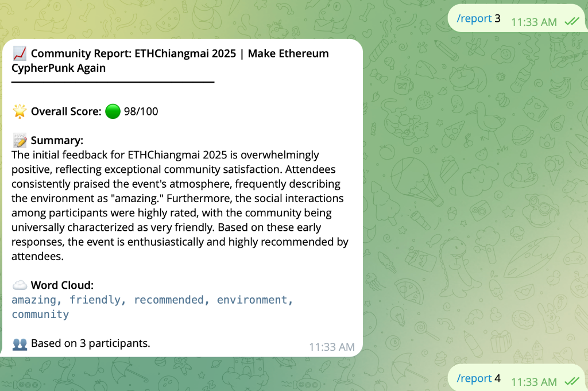

# EchoRank@communityEchoRankBot: 听见社区的心跳 🎤
### Emotion-Aware Decentralized Message Board

[跳转到英文版本 (Jump to English) ↓](#english-version)

---

## 🏗️ 1. 混合架构：隐私与逻辑的平衡
### Hybrid Architecture: Privacy & Logic

*   **本地 AI Hub**: SenseVoice 毫秒级提取情绪与关键词。
*   **云端 Logic AI**: Gemini 处理长文总结与活动自动审核。
*   **隐私屏障**: 原始音频永不离机，仅外发脱敏后的文本。

---

## 👂 2. 感知之耳：实时情绪捕捉
### The Ear: Real-time Emotion Sensing

*   **多维度识别**: 自动分析语速、笑声、语气。
*   **自动分类**: 🎉 兴奋、🤯 头脑风暴、🥲 感动瞬间。
*   **深度理解**: 将冰冷的文字转化为带温度的社区洞察。

---

## 🧬 3. 声纹 ID：去中心化身份验证
### Voiceprint ID: Decentralized Identity

*   **唯一性**: 基于 Cam++ 模型生成 192 维声纹嵌入，比指纹更难伪造。
*   **抗攻击**: 有效防止女巫攻击（一人多号刷量），因为你无法改变声带结构。
*   **无感验证**: 说话即登录，无需记忆密码或私钥。

---

## 🎬 4. 演示流：智能审核与引导
### Demo Flow: AI Validation & Guidance

| 1. 提交活动 (Submit) | 2. AI 审核 (Approve/Reject) | 3. 新手引导 (Guide) |
| :---: | :---: | :---: |
|  |  |  |

*   **高效入驻**: 粘贴 URL，AI 自动判定“Web3 / 本地 / 共创”三大标签，剔除无关内容（见上图 Rejected 案例）。
*   **新手指引**: 针对新用户，机器人会自动弹出清晰的 1-2-3 操作指南。

---

## 🎬 5. 演示流：语音反馈与报告
### Demo Flow: Voice Feedback & Report

| 3. 语音反馈 (Feedback) | 4. 共识报告 (Report) |
| :---: | :---: |
|  |  |

*   **自然交互**: 告别打字，直接说出此刻心情。
*   **共识聚合**: `/report` 一键生成由全社区共创的深度分析报告。

---

## 💻 6. 主权节点：一键产品化部署
### Sovereign Node: One-Click Deployment

*   **Mac 友好**: 充分利用 Apple Silicon 强劲算力。
*   **Docker 驱动**: `setup-production.sh` 极速搭建。
*   **数据主权**: 数据库、AI 模型全本地运行。

---

## 🛡️ 7. 隐私与价值：声纹 NFT
### Privacy & Value: Voiceprint NFT

*   **阅后即焚 (Burn After Reading)**: 原始音频在本地主权节点处理完后**立即物理删除**，绝不留存。
*   **不可逆哈希 (Irreversible Hash)**: 仅上链 `Hash(声纹 + 活动ID)`。数学上保证无法反推原始声音。
*   **情绪资产**: 这枚 NFT 证明了你不仅“到场”，而且贡献了真实的“情绪价值”。

---

## 🚀 8. 未来路线图
### Future Roadmap

*   **Identity**: 记录每位参与者的“情绪贡献度”。
*   **Gasless NFT**: 自动为空投地址铸造共鸣纪念品。
*   **$EMO Token**: 激励高质量真实反馈进入闭环。

---

# [English Version] EchoRank V2
### Listen to the Community Pulse

[Back to Chinese ↑](#chinese-version)

---

## 🏗️ 1. Architecture: Privacy & Logic

*   **Hybrid AI**: Local SenseVoice (Privacy) + Cloud Gemini (Logic).
*   **Barrier**: Raw audio never leaves your node; only anonymized text is analyzed.

---

## 👂 2. The Ear: Real-time Emotion Sensing

*   **Multimodal**: Detects tempo, laughter, and tone automatically.
*   **Categorization**: 🎉 Excited, 🤯 Brainstorming, 🥲 Moving.

---

## 🧬 3. Voiceprint ID: Decentralized Identity

*   **Unique**: Generates 192-dim embedding via Cam++ model.
*   **Anti-Sybil**: Prevents fake accounts; you can't fake your vocal cords.
*   **Seamless**: Speak to log in. No passwords, no keys.

---

## 🎬 4. Demo Flow: Submission & Validation
| 1. Submit Activity | 2. AI Validation (Approve/Reject) | 3. Help/Guidance |
| :---: | :---: | :---: |
|  |  |  |

---

## 🎬 5. Demo Flow: Engagement & Report
| 3. Voice Feedback | 4. Consensus Report |
| :---: | :---: |
|  |  |

---

## 💻 6. Sovereign Node: Production Ready

*   **One-Click**: Deploy via `setup-production.sh`.
*   **Portable**: Fully containerized with Docker.

---

## 🛡️ 7. Privacy & Value: Voiceprint NFT
*   **Burn After Reading**: Raw audio is **deleted locally** immediately after processing. Never uploaded.
*   **Irreversible Hash**: Only `Hash(Voiceprint + EventID)` is stored. Your voice data is safe.
*   **Emotional Asset**: The NFT proves your authentic emotional contribution to the event.

---

## 🚀 8. Future Roadmap

*   **Identity**: Track "Emotional Contribution" per participant.
*   **Gasless NFT**: Auto-mint airdrops for attendees.
*   **$EMO Token**: Incentivize authentic feedback loops.

---

# 让活动记忆在链上流动
### Make Event Memories Flow on the Chain
